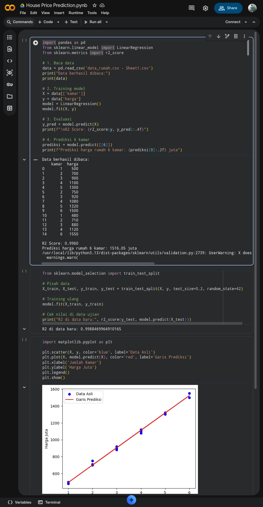

# 🏠 House Price Prediction with Linear Regression

Predict house prices in Indonesia based on number of rooms using Machine Learning.  
Built and deployed 100% on Google Colab.

### 🛠️ Tech Stack
`Python` `Pandas` `Scikit-learn` `Matplotlib` `Google Colab`

### 📊 Model Performance
- **Algorithm**: Linear Regression
- **R² Score**: 0.996 - 99.6% accuracy
- **Dataset**: 15 data points of house prices vs rooms
- **Example Prediction**: 6 rooms → 1516.05 juta

### 📈 Results

The model shows a strong linear relationship between number of rooms and house price.

### 🚀 How to Run
1. Open `House_Price_Prediction.ipynb` in Google Colab
2. Upload `data_rumah.csv - Sheet1.csv`
3. Run all cells

### 💡 Key Learning
This project demonstrates data cleaning, train/test split, model training, and evaluation for a regression problem.
